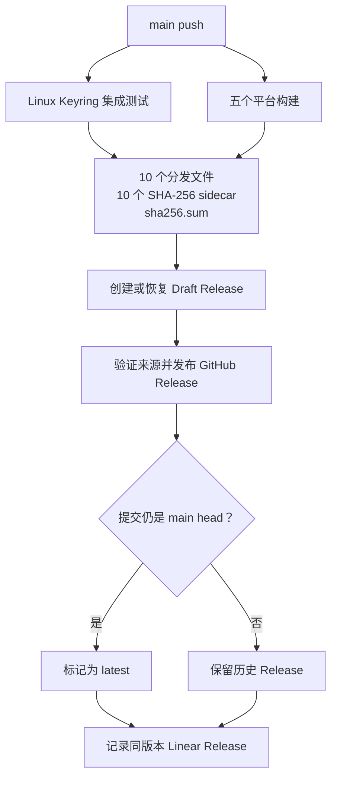

# 主分支发布

## 发布契约

- 在版本控制中将 `deno.json` 保持为 `0.0.0-dev`。
- `.github/workflows/ship-main.yml` 根据推送的提交生成 `0.0.<commit timestamp>-g<short commit>`。
- 每次 `main` 更新都会进入串行发布队列。运行成功后会自动创建 tag 和 GitHub Release。
- 发布任务不会取消已经在运行的任务，队列最多保留 100 个等待中的任务。
- 不要手动递增版本、创建发布 tag 或推送 tag。
- 不要创建 npm、JSR、Homebrew 或 cargo-dist 发布。

## 准备

1. 确认 checkout 为 `main`，`origin` 为 `https://github.com/jihuanshe/linear`，并且已经理解所有计划中的变更。
2. 在第一次提交前检查实际生效的提交身份：

   ```bash
   git config --show-origin --get user.name
   git config --show-origin --get user.email
   ```

3. 提交所有计划中的变更。将无关事项放在不同提交中。
4. 获取 `origin/main`。如果它领先于当前分支则进行 rebase；遇到实质性冲突时停止并先询问用户。
5. 针对最终提交运行完整的本地发布门禁：

   ```bash
   deno task verify-release
   ```

   在工作区干净且门禁通过前不要 push。

## 推送

推送 `main`，然后等待该次推送创建的确切工作流运行：

```bash
sha="$(git rev-parse HEAD)"
git push origin main
run_id=""
for _ in {1..12}; do
  run_id="$(
    gh run list --workflow ship-main.yml --branch main --limit 20 \
      --json databaseId,headSha \
      --jq ".[] | select(.headSha == \"$sha\") | .databaseId" | head -n 1
  )"
  [[ -n "$run_id" ]] && break
  sleep 5
done
test -n "$run_id"
gh run watch "$run_id" --exit-status
```

如果因为 `origin/main` 已前进而导致推送被拒绝，则获取更新、rebase、重新运行 `deno task verify-release`，然后再次推送。遇到实质性冲突时先询问用户。

## CI 发布工作流



每个平台产出一个安装归档、一个独立自更新二进制和各自的 SHA-256 sidecar。GitHub Release 只有在对应提交仍是当前 `main` head 时才标记为 latest，防止较早的排队任务把安装目标倒退到旧版本。Linear Release 使用准确的 `before..HEAD` 推送范围；其 ID 和 URL 必须非空，版本必须与 GitHub Release 一致。

除非 Keyring 集成测试和每个目标的构建都成功，否则不得运行 GitHub Release 任务。除非 GitHub Release 任务成功，否则不得运行 Linear Release 任务。

## 发布后验证

根据推送的提交推导预期版本，并检查该确切 Release：

```bash
timestamp="$(git show -s --format=%ct HEAD)"
version="0.0.${timestamp}-g$(git rev-parse HEAD | cut -c1-7)"
gh release view "$version" \
  --json tagName,targetCommitish,isDraft,isPrerelease,url,assets
git fetch origin main
if [[ "$(git rev-parse origin/main)" == "$(git rev-parse HEAD)" ]]; then
  test "$(gh api repos/jihuanshe/linear/releases/latest --jq .tag_name)" = "$version"
fi
```

必须确认该 Release 指向推送的提交、已经发布且不是 prerelease。如果推送的提交仍是当前 `main`，还必须确认它是 latest。它必须包含 21 个文件：10 个可分发文件、10 个校验和 sidecar 文件以及 `sha256.sum`。

如果 mise 可用，验证公开安装解析出的版本是否符合预期：

```bash
actual="$(mise x "github:jihuanshe/linear[minimum_release_age=0s]@$version" -- linear --version)"
test "$actual" = "linear $version"
```

`minimum_release_age=0s` 仅对本工具绕过 mise 默认的 24 小时 Release 等待时间。

## 失败处理

- 本地源码检查、CI Keyring 集成检查或构建失败时，不得产生已发布的 Release。使用新的 `main` 提交修复问题。
- 被取消的任务不算已发布 Release，可能会留下不可见的 Draft。`main` 前进后不要重新运行它；如有需要，之后再清理。
- 固定的并发组会串行执行发布任务，并保留最多 100 个待处理的 `main` 更新。已完成的历史 Release 保持不可变且可下载。
- 如果 GitHub 拒绝写入权限、证明或 Release 创建，报告阻塞它的仓库设置，不要改用个人 token 或私有 runner。
