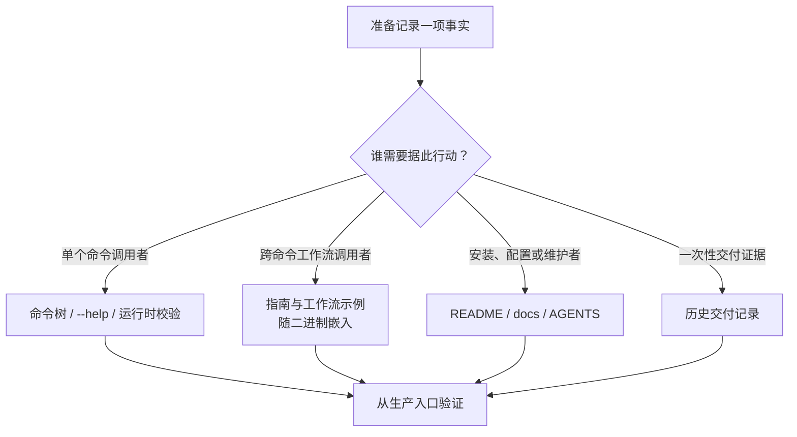

# Linear CLI 维护规则

本仓维护 `jihuanshe/linear`：一个面向人类、AI Agent 和无人值守自动化的 Linear CLI。用户入口、系统边界、安装和任务导航由 [README](README.md) 负责；本文件只记录代码、文档和发布资产的维护约束。

`CLAUDE.md` 是指向本文件的兼容性符号链接，不单独维护。

## 事实归属

| 事实                                     | 权威位置                                                                                                                  |
| ---------------------------------------- | ------------------------------------------------------------------------------------------------------------------------- |
| 命令、参数、别名和单命令语义             | `src/cli.ts`、`src/commands/`、对应 `test/commands/`                                                                      |
| 共享业务操作与文件关联                   | 命令模块导出的操作、`src/operations/`，由单命令和 `src/delivery/` 共用                                                    |
| 渐进发现、能力元数据和机器契约           | `src/commands/usage.ts`、命令模块中的 `withUsageMetadata`、对应测试                                                       |
| 跨命令且随版本变化的工作流               | `docs/guides/`、`src/guides/`                                                                                             |
| 可编辑的工作流示例与二进制分发           | `recipes/`、`src/recipes/`、`src/commands/recipe.ts`                                                                      |
| Linear GraphQL schema 与有类型约束的文档 | `graphql/schema.graphql`、`codegen.ts`、`src/**` 中的 `gql`                                                               |
| 认证、配置与凭据解析                     | `src/config.ts`、`src/credentials.ts`、`src/utils/graphql.ts`、`docs/authentication.md`、`docs/configuration.md`          |
| Issue 交付清单、执行和恢复               | `src/delivery/`、`src/commands/issue/issue-plan.ts`、`src/commands/issue/issue-apply.ts`、`docs/guides/issue-delivery.md` |
| Agent 接口设计与一次性交付记录           | `docs/agent-interface-architecture.md`、`docs/agent-interface-delivery.md`、`docs/skill-migration-ledger.md`              |
| 开发工具版本、任务与权限                 | `mise.toml`、`mise.lock`、`deno.json`、`docs/deno-permissions.md`                                                         |
| 提交前检查与 Markdown 规则               | `prek.toml`、`.markdownlint-cli2.jsonc`、`.autocorrectrc`                                                                 |
| Orb 工具链                               | `.agents/setup`、`.agents/resume`                                                                                         |
| PR 门禁与滚动发布                        | `.github/workflows/verify-pull-request.yml`、`.github/workflows/ship-main.yml`、`.agents/skills/releasing/SKILL.md`       |

命令事实以实时 Cliffy 命令树为准。能由一个命令完整表达的内容写进该命令的描述、选项帮助或校验错误；跨多个命令的 Linear 工作流写进内嵌指南；可供用户审阅和修改的脚本及说明写进工作流示例；安装、配置和长期架构事实写进 `docs/`。`agent-interface-delivery.md` 是历史交付记录，不承载当前命令契约。



供 Agent 激活本 CLI 的外部 Skill 由 `jihuanshe/skills` 维护。本仓不生成命令手册，也不把外部 Skill 当作命令事实源。

## 实现边界

- 常见领域操作、名称解析和安全写入使用专用命令。`linear schema` 与 `linear api` 只补专用命令未覆盖的长尾 GraphQL；已有专用写命令时，不用原生 mutation 绕过它的校验、冲突保护或读回。
- `usage` 与根／领域导航从实际 Cliffy 命令树生成，不维护第二份命令目录。`withUsageMetadata` 与定义和执行该行为的命令模块放在一起；`writes`、`interactive`、`confirmation` 和 `outputModes` 描述能力，不代表授权。
- 指南的 Markdown 是内容事实源。元数据头只使用 `name`、`description`、`commands`；它定义命令与指南的关系。新增指南时同步 `src/guides/content.ts` 的静态导入清单，指南测试必须证明文件、名称、命令引用和二进制嵌入一致。
- 工作流示例的说明与脚本以 `recipes/` 为源，通过静态文本导入随二进制分发。`linear recipe` 只展示和导出，不执行脚本、不访问网络。说明必须写清依赖、输入、写入范围及失败后的动作；安装用户不能依赖源码目录。测试核对说明、脚本、索引与编译产物的一致性。
- 保留 GraphQL 字段名称和嵌套结构。分页 JSON 保留 `{nodes,pageInfo}` 分页连接，拼接 `nodes`，不扁平化或重命名。机器输出 stdout 不混入进度、诊断或提示；具体支持的输出模式以目标命令为准。
- 显式无效输入必须失败，不能回退或静默忽略。命令 action 使用 `errors.ts` 的领域错误并以 `handleError` 统一处理。专用写入结果由 `write-result.ts` 序列化；JSON 错误也只在 stdout 输出一份结果，人类诊断写 stderr。GraphQL／网络／回执错误保留 `none`、`applied`、`unknown` 写入效果，不能用普通错误抹掉已确认效果。堆栈只在 `LINEAR_DEBUG=1` 时显示。
- 优先静态 import；只有运行时成本或平台边界确实要求时才用 dynamic import。避免 `any`，GraphQL 结果沿 `gql` document 推断；空值判断优先使用 `== null`／`!= null`。
- 终端样式使用 `@std/fmt/colors`。添加短选项前搜索全局和同路径选项；Cliffy 会优先解析全局别名。
- 修改 Deno 权限前按 `docs/deno-permissions.md` 盘点所有生产、测试、Orb 和发布入口，不能只改 `deno.json`。

## 原始读取与写入

- Issue、Comment、Project、Initiative、Document、Milestone 的字段替换通过 `utils/replacement.ts` 共用原始依据比较；读取保留 `{organization, <API 对象>}`、稳定 ID，以及字段缺失与显式值的区别。
- 原始读取在讨论／编辑前保存；提交前最后读取。不能临时读取新值冒充用户的原始依据。仅提交判定为 `write` 的字段，一个字段冲突即拒绝整个更新；Markdown 精确比较，只有明确 ID 集合使用集合语义。
- 默认缺依据拒绝；`--unprotected` 只跳过原值比较，保留领域校验。Document 行内评论锚点是独立规则。原生增量不改成完整集合替换。
- 实际 mutation 使用解析后的同一 UUID。专用命令和 `apply` 共用有类型约束的操作；`beforeWrite` 只在真实派发前调用，准备失败或无需写入时不调用。
- 原生 `api` 是明确例外：mutation 要求 `--unprotected`，保持 GraphQL 响应，自动分页仅处理 query。它不具有专用领域校验或执行账本。

## Issue 交付与恢复

- `plan` 对远端零写入；`apply` 要求 `--confirm-workspace` 精确匹配交付清单，并在 mutation 前使用同一凭据核对实际工作区。
- 单命令不强制交付清单；需要组合和恢复时再建立清单。整批本地文件首写前读取并校验，`base`／`baseFile` 保存原始读取。`set` 使用共享 Issue 操作的选项名；`apply` 直接调用其实现，不组装 argv 或启动子 CLI。
- 派发 mutation 前先把执行项记为 `unknown`。结果未知时停止一切自动续跑，等待显式对账；不把网络失败解释为远端未写入。
- 执行账本记录在交付清单旁：真实派发前记为 `unknown`，取得有效回执后记为 `completed`；上传有独立回执。已确认写入不因读回失败变成可重试。两个执行者不得并发 `apply` 同一交付清单；执行账本不是锁或事务，部分成功不自动回滚。
- 交付清单与执行账本使用 `schemaVersion: 2`，明确拒绝版本 1。保留旧文件与匹配版本对账后，只为剩余工作新建清单，不自动迁移重放。修改格式、状态、执行项 key、回执或恢复语义时，同步 `engine`／`checkpoint` 测试和 `docs/guides/issue-delivery.md`。测试走生产入口，不复写实现。

## Kadoraba 实时 API 实验

`LINEAR_KADORABA_API_KEY` 是 Kadoraba 测试工作区的专用实验凭据。只有正确性依赖未文档化或不确定的 Linear API 行为、且确定性本地测试无法裁定时，才使用范围受限的实时实验。

- 凭据只提供认证，不授权 mutation。先取得当前实验的明确授权，说明需要验证的行为和受影响对象；授权后可完成该范围内的必要测试。扩展到其他工作区、共享既有对象、预期外成本／停机或无法清理的资源时重新确认。
- 只检查专用凭据是否存在。不得打印、派生、指纹化、比较或检查其内容；不得读取、使用或回退到已有 `LINEAR_API_KEY`。
- CLI 需要 `LINEAR_API_KEY` 时，只对单个进程映射：`env LINEAR_API_KEY="$LINEAR_KADORABA_API_KEY" <linear-command>`。
- 第一次 mutation 前，用同一个目标可执行文件运行 `auth whoami --json`。只有 `organization.name` 为 `Kadoraba` 或 `organization.urlKey` 为 `kadoraba` 才能继续；其他身份立即停止。
- 使用唯一、可丢弃的测试对象，优先只修改本实验创建的对象。通过生产 CLI 入口清理，等待传播后结构化读回；报告所有无法删除的对象或资产。除非实验本身验证上传，否则不要创建缺少删除入口的独立 upload。
- PR 验收必须测试确切目标提交：运行 `deno task install`，再用绝对路径调用编译后的二进制。Orb `PATH` 上的 `linear` 是源码包装脚本，不是安装产物。
- 不通过中断 mutation、破坏认证或断网人为制造真实环境中的 `unknown`。这类路径使用确定性故障注入；只有用户另外授权实验及对账计划时才触碰真实远端。

## 开发与验证

1. 使用 `mise.toml` 固定的 Deno `2.9.6` 及检查工具。非 Orb 环境按 [README 开发入口](README.md#开发)安装工具和 hook；Orb 只在工具链缺失或损坏时运行 `.agents/setup`，平时由 `.agents/resume` 维护源码包装脚本。
2. 修改前读取负责该行为的模块及其测试。命令测试通常镜像源码路径，例如 `src/commands/issue/issue-view.ts` 对应 `test/commands/issue/issue-view.test.ts`。
3. 行为变化时修改对应层级测试。开发中运行最窄的相关 `deno task test --filter ...` 或测试文件；只在有意更新快照时运行 `deno task update-snapshots`。测试任务已固定 `TZ=UTC`。使用 Deno task、check 和 lint，不使用 `tsc` 或把 LSP 诊断当作验证结果。
4. 修改 `graphql/schema.graphql` 或 `src/` 中的 `gql` document 后运行 `deno task generate-graphql-types`。生成文件被 ignore，不提交。
5. 修改 Markdown 时检查相对链接；修改 Mermaid 时用目标渲染器解析并实际渲染。指南和示例中的操作指引必须提供安装后可用的命令。修改指南、示例或命令树时运行对应测试，确认元数据、内容与实时命令树一致，并验证编译产物离开源码目录后仍可读取。
6. 提交前运行完整门禁：

   ```bash
   mise exec -- deno task verify-release
   git diff --check
   ```

pre-commit hook 只检查暂存文件的格式、Markdown 结构和中英文排版；`deno task verify-source` 负责 GraphQL codegen、format check、代码与 Markdown lint、AutoCorrect、type check 和所有非 Keyring 测试。`verify-release` 是源码门禁，也是 Pull Request 源码门禁，不包含编译产物、Linux 密钥环集成测试或五平台构建。后两者由滚动发布 workflow 执行。

未经用户明确授权，不 push 或发布。用户要求发布 `main` 时，加载并遵循 `.agents/skills/releasing/SKILL.md`；不要手工修改版本、创建 tag 或另建发布流程。
