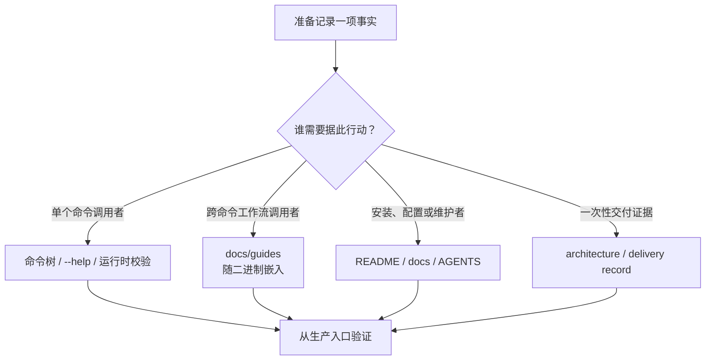

# Linear CLI 维护规则

本仓维护 `jihuanshe/linear`：一个面向人类、AI Agent 和无人值守自动化的 Linear CLI。用户入口、系统边界、安装和任务导航由 [README](README.md) 负责；本文件只记录代码、文档和发布资产的维护约束。

`CLAUDE.md` 是指向本文件的兼容性 symlink，不单独维护。

## 事实所有者

| 事实                                    | Canonical owner                                                                                                           |
| --------------------------------------- | ------------------------------------------------------------------------------------------------------------------------- |
| 命令、参数、别名和单命令语义            | `src/cli.ts`、`src/commands/`、对应 `test/commands/`                                                                      |
| 渐进发现、能力元数据和机器契约          | `src/commands/usage.ts`、命令模块中的 `withUsageMetadata`、对应测试                                                       |
| 跨命令且随版本变化的工作流              | `docs/guides/`、`src/guides/`                                                                                             |
| Linear GraphQL schema 与 typed document | `graphql/schema.graphql`、`codegen.ts`、`src/**` 中的 `gql`                                                               |
| 认证、配置与凭据解析                    | `src/config.ts`、`src/credentials.ts`、`src/utils/graphql.ts`、`docs/authentication.md`、`docs/configuration.md`          |
| Issue delivery manifest、执行和恢复     | `src/delivery/`、`src/commands/issue/issue-plan.ts`、`src/commands/issue/issue-apply.ts`、`docs/guides/issue-delivery.md` |
| Agent 接口设计与一次性交付记录          | `docs/agent-interface-architecture.md`、`docs/agent-interface-delivery.md`、`docs/skill-migration-ledger.md`              |
| Deno 版本、任务与权限                   | `mise.toml`、`deno.json`、`docs/deno-permissions.md`                                                                      |
| Orb 工具链                              | `.agents/setup`、`.agents/resume`                                                                                         |
| PR 门禁与滚动发布                       | `.github/workflows/verify-pull-request.yml`、`.github/workflows/ship-main.yml`、`.agents/skills/releasing/SKILL.md`       |

命令事实只由实时 Cliffy 命令树拥有。能由一个命令完整表达的内容写进该命令的 description、option 或校验错误；跨多个命令、且需要随二进制版本匹配的 Linear 工作流写进内嵌 Guide；安装、配置和长期架构事实写进 `docs/`。`agent-interface-delivery.md` 是历史交付记录，不承载当前命令契约。



供 Agent 激活本 CLI 的外部 Skill 由 `jihuanshe/skills` 维护。本仓不生成命令手册，也不把外部 Skill 当作命令事实源。

## 实现边界

- 常见领域操作、名称解析和安全写入使用专用命令。`linear schema` 与 `linear api` 只补专用命令未覆盖的长尾 GraphQL；已有专用写命令时，不用 raw mutation 绕过它的校验、冲突保护或读回。
- `usage` 与根／领域导航从实际 Cliffy tree 生成，不维护第二份命令目录。`withUsageMetadata` 与定义和执行该行为的命令模块放在一起；`writes`、`interactive`、confirmation 和 output mode 描述能力，不代表授权。
- Guide 的 Markdown 是内容事实源。frontmatter 只使用 `name`、`description`、`commands`；它拥有 command-to-guide 关系。新增 Guide 时同步 `src/guides/content.ts` 的静态 import manifest，Guide 测试必须证明文件、名称、命令引用和二进制嵌入一致。
- 保留 GraphQL 字段名称和嵌套结构。分页 JSON 保留 `{nodes,pageInfo}` connection，拼接 `nodes`，不扁平化或重命名。机器输出 stdout 不混入进度、诊断或提示；具体支持的 output mode 以目标命令为准。
- 显式无效输入必须失败并给出指引，不能 fallback 或静默忽略。命令 action 使用 `src/utils/errors.ts` 的 `ValidationError`、`NotFoundError`、`AuthError` 或 `CliError`，并以 `handleError(error, "Failed to <action>")` 收口；错误写 stderr，stack trace 只在 `LINEAR_DEBUG=1` 时显示。
- 优先静态 import；只有运行时成本或平台边界确实要求时才用 dynamic import。避免 `any`，GraphQL 结果沿 `gql` document 推断；空值判断优先使用 `== null`／`!= null`。
- 终端样式使用 `@std/fmt/colors`。添加短 flag 前搜索全局和同路径选项；Cliffy 会优先解析全局别名。
- 修改 Deno permission 前按 `docs/deno-permissions.md` 盘点所有生产、测试、Orb 和发布入口，不能只改 `deno.json`。

## Issue delivery

- `plan` 对远端零写入；`apply` 要求 `--confirm-workspace` 精确匹配 manifest，并在 mutation 前使用同一凭据核对实际 workspace。
- 单次与 batch 共用 manifest v1。整批本地文件在第一笔 mutation 前校验；update 在每个 Issue 的第一笔 mutation 前重读目标，并按 base／desired／remote 做三方比较。
- mutation 发射前先把 in-flight 执行项记为 `unknown`。结果未知时停止一切自动续跑，等待显式对账；不把网络失败解释为远端未写入。
- checkpoint 记录在 manifest 旁，负责跳过已确认成功的执行项和拒绝结构漂移，不是锁或事务。两个执行者不得并发 apply 同一 manifest；部分成功不自动回滚。
- 修改 manifest schema、执行顺序、状态词表、checkpoint key 或恢复语义时，同时更新 engine/checkpoint 测试和 `docs/guides/issue-delivery.md`。测试必须走生产 `plan`／`apply` 入口，不复写被测实现。

## Kadoraba 实时 API 实验

`LINEAR_KADORABA_API_KEY` 是 Kadoraba 测试 workspace 的专用实验凭据。只有正确性依赖未文档化或不确定的 Linear API 行为、且确定性本地测试无法裁定时，才使用范围受限的实时实验。

- 凭据只提供认证，不授权 mutation。先取得当前实验的明确授权，说明需要验证的行为和受影响对象；授权后可完成该范围内的必要测试。扩展到其他 workspace、共享既有对象、预期外成本／停机或无法清理的资源时重新确认。
- 只检查专用凭据是否存在。不得打印、派生、指纹化、比较或检查其内容；不得读取、使用或 fallback 到已有 `LINEAR_API_KEY`。
- CLI 需要 `LINEAR_API_KEY` 时，只对单个进程映射：`env LINEAR_API_KEY="$LINEAR_KADORABA_API_KEY" <linear-command>`。
- 第一次 mutation 前，用同一个目标可执行文件运行 `auth whoami --json`。只有 `organization.name` 为 `Kadoraba` 或 `organization.urlKey` 为 `kadoraba` 才能继续；其他身份立即停止。
- 使用唯一、可丢弃的测试对象，优先只修改本实验创建的对象。通过生产 CLI 入口清理，等待传播后结构化读回；报告所有无法删除的对象或资产。除非实验本身验证上传，否则不要创建缺少删除入口的独立 upload。
- PR 验收必须测试确切目标 commit：运行 `deno task install`，再用绝对路径调用编译后的二进制。Orb `PATH` 上的 `linear` 是源码 wrapper，不是安装产物。
- 不通过中断 mutation、破坏认证或断网人为制造 live `unknown`。这类路径使用确定性故障注入；只有用户另外授权实验及对账计划时才触碰真实远端。

## 开发与验证

1. 使用 `mise.toml` 固定的 Deno `2.9.4`。非 Orb 环境运行 `mise install`；Orb 只在工具链缺失或损坏时运行 `.agents/setup`，平时由 `.agents/resume` 维护源码 wrapper。
2. 修改前读取 owner 模块及其测试。命令测试通常镜像源码路径，例如 `src/commands/issue/issue-view.ts` 对应 `test/commands/issue/issue-view.test.ts`。
3. 行为变化时修改对应层级测试。开发中运行最窄的相关 `deno task test --filter ...` 或测试文件；只在有意更新快照时运行 `deno task update-snapshots`。测试任务已固定 `TZ=UTC`。使用 Deno task、check 和 lint，不使用 `tsc` 或把 LSP 诊断当作验证结果。
4. 修改 `graphql/schema.graphql` 或 `src/` 中的 `gql` document 后运行 `deno task generate-graphql-types`。生成文件被 ignore，不提交。
5. 修改 Markdown 时检查相对链接；修改 Mermaid 时用目标 renderer 解析并实际渲染。修改 Guide 或命令树时运行 Guide 相关测试，确认 frontmatter 与实时 tree 一致。
6. 提交前运行完整门禁：

   ```bash
   deno task verify-release
   git diff --check
   ```

`deno task verify-source` 负责 GraphQL codegen、format check、lint、type check 和所有非 Keyring 测试；`verify-release` 是完整本地门禁，也是 Pull Request Source gate。Linux Keyring integration 和五平台构建由滚动发布 workflow 执行。

未经用户明确授权，不 push 或发布。用户要求发布 `main` 时，加载并遵循 `.agents/skills/releasing/SKILL.md`；不要手工修改版本、创建 tag 或另建发布流程。
