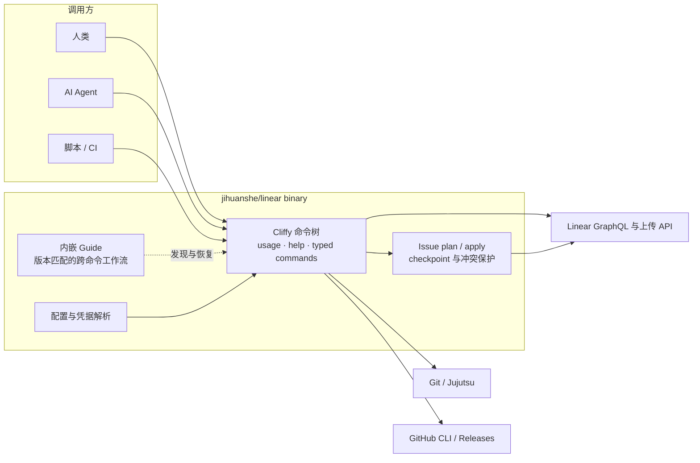
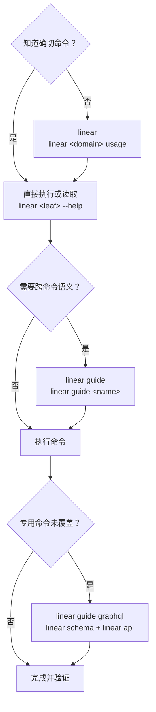

# Linear CLI

面向人类、AI Agent 和无人值守自动化的 [Linear](https://linear.app/) CLI。它提供可发现的专用命令、机器可读输出、Git／Jujutsu 上下文，以及带冲突保护和 checkpoint 的 Issue 交付协议。

> [!IMPORTANT]
> [`jihuanshe/linear`](https://github.com/jihuanshe/linear) 是 [`schpet/linear-cli`](https://github.com/schpet/linear-cli) 的下游 fork。它保留上游的终端工作流，并有意强化自动化、输出和 mutation 安全契约。两个发行版的命令面并不等价。

本项目不是 Linear 的官方产品，也不隶属于 Linear 或得到其认可。

## 系统边界



常见 Linear 操作优先走专用命令；`linear schema` 和 `linear api` 是专用命令没有覆盖时的 GraphQL 逃生通道。`linear api` 也能发送 mutation，但不提供专用写命令的名称解析、冲突保护或写后核算。

## Quick Start

使用 mise 安装最新的滚动发布构建：

```bash
mise use -g "github:jihuanshe/linear[minimum_release_age=0s]@latest"
linear --version
linear version --json
```

mise 会选择匹配 macOS、Linux 或 Windows 的预编译二进制；运行时不需要 Deno 或 Node.js。`minimum_release_age=0s` 只为本工具跳过 mise 对新 GitHub Release 的默认等待时间。需要可复现安装时，把 `latest` 换成 [GitHub Releases](https://github.com/jihuanshe/linear/releases/latest) 中的确切版本。

在 Linear 的 Settings > Account > Security & Access 创建 personal API key，然后通过提示符登录并核对身份：

```bash
linear auth login
linear auth whoami --json
```

在项目仓库中生成默认 workspace、team 和排序配置：

```bash
linear config
```

多 workspace、Keychain／Credential Manager、CI 凭据和明文 fallback 见[认证与 workspace 凭据](docs/authentication.md)；完整配置项与优先级见[配置](docs/configuration.md)。更新已安装的发行版使用 `linear update`。

## 找命令和工作流

知道确切命令时直接执行，不需要固定的预检链。不确定时按需下钻：



常用发现入口：

```bash
linear                            # 根导航
linear issue usage                # Issue 领域的命令、选项和能力
linear issue create --help        # 单个命令的精确契约
linear usage --json               # 机器可读命令树
linear guide                      # 版本匹配的 Guide 索引
linear guide issue-delivery       # 一篇完整工作流 Guide
```

`usage` 和 `--help` 由当前二进制的真实命令树生成；Guide 随二进制编译发布，负责跨命令工作流，不复制单个命令的 flag。

## 使用示例

终端工作流可以从显式 Issue identifier 开始，也可以从 Git branch 名中的 identifier（如 `eng-123-fix-login`），或 Jujutsu commit 的 `Linear-issue` trailer 推断当前 Issue：

```bash
linear issue mine
linear issue query --search "login bug"
linear issue view ENG-123
linear issue start ENG-123
linear issue update ENG-123 --state "In Progress"
linear issue pr ENG-123
```

无人值守执行应禁用提示、分离 stdout 与 stderr，并只消费目标命令明确提供的结构化输出：

```bash
export LINEAR_PROMPT_DISABLED=1
NO_COLOR=1 linear issue view ENG-123 --json >issue.json 2>error.log
jq -e . issue.json >/dev/null
```

`--json` 和 `--no-pager` 不是全局选项，以目标命令的 `--help` 为准。多行 Markdown 使用 `--description-file` 或 `--body-file`，不要把正文塞进 shell quoting。写命令、确认 flag、`LINEAR_PROMPT_DISABLED=1` 和 JSON 输出都只描述执行机制，不构成用户授权。

一次交付同时包含字段、评论、文件、侧栏 Attachment 或 Issue relation 时，使用同一份 delivery manifest：

```bash
linear issue plan --file delivery.json
linear issue apply --file delivery.json --confirm-workspace jihuanshe
```

`plan` 零写入；`apply` 在 mutation 前校验 workspace、文件和 update base，并通过 manifest 旁的 checkpoint 保留部分成功。完整协议见 `linear guide issue-delivery`。

## 按任务查入口

| 任务                                            | Canonical 入口                                               |
| ----------------------------------------------- | ------------------------------------------------------------ |
| 发现命令、选项与机器能力                        | `linear`、`linear <domain> usage`、`linear <leaf> --help`    |
| 读取跨命令工作流                                | `linear guide`、`linear guide <name>`                        |
| 登录、切换 workspace、排查凭据                  | [认证与 workspace 凭据](docs/authentication.md)              |
| 配置 team、排序、VCS 和附件行为                 | [配置](docs/configuration.md)                                |
| 自动化输出、分页、Markdown 与写后读回           | `linear guide automation`                                    |
| 编写可独立交接的 Issue                          | `linear guide issue-authoring`                               |
| 交付含文件、Attachment 或关系的单个／批量 Issue | `linear guide issue-delivery`                                |
| 查询专用命令未覆盖的字段                        | `linear guide graphql`、`linear schema`、`linear api --help` |
| 理解 Agent 接口的知识所有权与设计               | [Agent 接口架构](docs/agent-interface-architecture.md)       |
| 修改 Deno 权限                                  | [Deno permission policy](docs/deno-permissions.md)           |
| 贡献代码                                        | [仓库维护规则](AGENTS.md)                                    |
| 发布 `main`                                     | [发布 Skill](.agents/skills/releasing/SKILL.md)              |

## 开发

仓库使用 `mise.toml` 固定 Deno 版本，`deno.json` 定义开发任务：

```bash
git clone https://github.com/jihuanshe/linear
cd linear
mise install
deno task verify-release
```

`deno task verify-release` 是本地完整门禁，也是 Pull Request 的 Source gate。它会生成 GraphQL 类型、检查格式和 lint、执行类型检查，并运行除 Linux Keyring integration 外的测试。具体模块、Guide、真实 API 实验和发布约束见 [`AGENTS.md`](AGENTS.md)；`main` 的滚动发布只按[发布 Skill](.agents/skills/releasing/SKILL.md)执行。

## 上游、反馈与许可证

原项目由 [Peter Schilling](https://github.com/schpet) 及[上游贡献者](https://github.com/schpet/linear-cli/graphs/contributors)创建。本 fork 特有的命令、自动化、发布或安全契约问题请提交到 [`jihuanshe/linear`](https://github.com/jihuanshe/linear/issues)；也能在未经修改的上游复现的问题，可以提交到 [`schpet/linear-cli`](https://github.com/schpet/linear-cli/issues)。

本项目依据 [ISC License](LICENSE) 分发。版权所有 (c) Peter Schilling 及贡献者。
