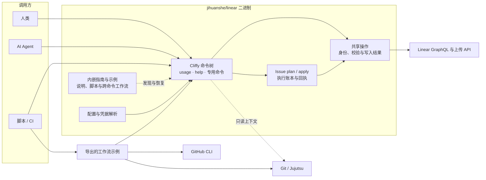
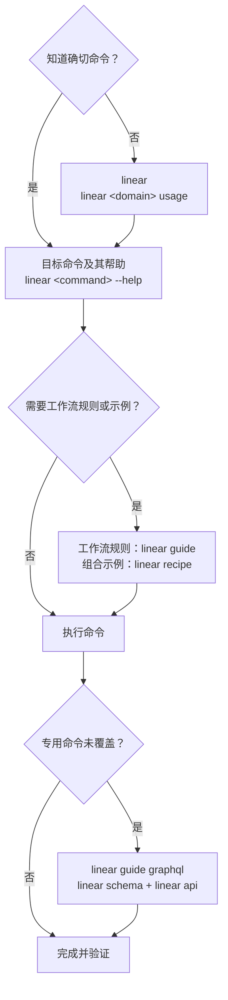

# Linear CLI

面向人类、AI Agent 和无人值守自动化的 [Linear](https://linear.app/) CLI。它提供可发现的专用命令、可保存的读取与受保护更新，以及共用这些操作的 Issue plan/apply。

> [!IMPORTANT]
> [`jihuanshe/linear`](https://github.com/jihuanshe/linear) 是 [`schpet/linear-cli`](https://github.com/schpet/linear-cli) 的下游 fork。它保留终端选择和编辑能力，并有意强化自动化、输出和 mutation 安全契约。两个发行版的命令面并不等价。

本项目不是 Linear 的官方产品，也不隶属于 Linear 或得到其认可。

## 系统边界



常见 Linear 操作优先走专用命令；`linear schema` 和 `linear api` 用于专用命令未覆盖的 GraphQL 能力。`linear api --unprotected` 可以显式发送原生 mutation，保留 GraphQL 响应；它不提供专用命令的领域校验、回执或恢复。

## 快速开始

使用 mise 安装最新的滚动发布构建：

```bash
mise use -g "github:jihuanshe/linear[minimum_release_age=0s]@latest"
linear --version
linear version --json
```

mise 会选择匹配 macOS、Linux 或 Windows 的预编译二进制。运行 CLI、读取指南和查看工作流示例不需要 Deno 或 Node.js；执行导出的示例脚本需要其说明列出的运行时和工具。`minimum_release_age=0s` 只为本工具跳过 mise 对新 GitHub Release 的默认等待时间。需要可复现安装时，把 `latest` 换成 [GitHub Releases](https://github.com/jihuanshe/linear/releases/latest) 中的确切版本。

在 Linear 的 Settings > Account > Security & Access 创建个人 API 密钥，然后通过提示符登录并核对身份：

```bash
linear auth login
linear auth whoami --json
```

在项目仓库中生成默认工作区、团队和排序配置：

```bash
linear config
```

多工作区、系统密钥环、CI 凭据和明文存储见[认证与工作区凭据](docs/authentication.md)；完整配置项与优先级见[配置](docs/configuration.md)。更新已安装的发行版使用 `linear update`。

## 找命令和工作流

知道确切命令时直接执行，不需要固定的预检链。不确定时按需下钻：



常用发现入口：

```bash
linear                            # 根导航
linear issue usage                # Issue 领域的命令、选项和能力
linear issue create --help        # 单个命令的精确契约
linear usage --json               # 机器可读命令树
linear guide                      # 内嵌指南索引
linear guide issue-delivery       # Issue 交付与恢复指南
linear recipe                     # 工作流示例索引
linear recipe guarded-edit        # 示例的完整说明
```

`usage` 和 `--help` 由当前二进制的真实命令树生成。指南与工作流示例随二进制编译发布，可离线读取；指南说明跨命令工作流，示例提供可审阅、修改的普通脚本。

## 使用示例

终端工作流可以从显式 Issue 编号开始，也可以从 Git 分支名中的编号（如 `eng-123-fix-login`），或 Jujutsu 提交的 `Linear-issue` 尾注推断当前 Issue：

```bash
linear issue mine
linear issue query --search "login bug"
linear issue view ENG-123
linear issue pick
linear issue view ENG-123 --json > original.json
linear issue update ENG-123 --base-file original.json --state "In Progress"
```

Git/Jujutsu 工作上下文、GitHub PR／自动链接、团队迁移与只读健康检查使用 `linear recipe` 中的工作流示例。`issue pick` 保留终端选择，只输出编号；配置团队的可读 key 用 `team key`，团队 UUID 从 `team list --json` 读取。

先读取示例说明，再按需导出脚本：

```bash
linear recipe guarded-edit
linear recipe guarded-edit --source > guarded-edit.js
linear recipe guarded-edit --json > guarded-edit.json
```

`--json` 返回 `name`、`description`、`filename`、`body` 和 `source`；`--source` 原样输出一个脚本。查看和导出不访问网络、不执行脚本，也不需要源码目录。执行导出的 JavaScript 示例需要 Deno，Shell 示例需要 `sh` 及其调用的工具；具体依赖与失败处理由每份示例说明。源码中的[示例目录](recipes/README.md)供维护者阅读。

无人值守执行应禁用提示、分离 stdout 与 stderr，并只消费目标命令明确提供的结构化输出：

```bash
export LINEAR_PROMPT_DISABLED=1
NO_COLOR=1 linear issue view ENG-123 --json >issue.json 2>error.log
jq -e ' .organization.id and .issue.id ' issue.json >/dev/null
```

`--json` 和 `--no-pager` 不是全局选项，以目标命令的 `--help` 为准。多行 Markdown 使用 `--description-file` 或 `--body-file`，避免 shell 引号改变正文。写命令、确认选项、`LINEAR_PROMPT_DISABLED=1` 和 JSON 输出都只描述执行机制，不构成用户授权。

普通更新直接用专用命令；组合多个执行项并需要记录恢复进度时，使用同一份交付清单：

```bash
linear issue plan --file delivery.json
linear issue apply --file delivery.json --confirm-workspace jihuanshe
```

`plan` 零写入；`apply` 共用单命令操作，在 mutation 前最后校验身份、文件和原始依据，并通过交付清单旁的执行账本保存逐项效果及回执。完整协议见 `linear guide issue-delivery`。

## 按任务查入口

| 任务                                         | 入口                                                         |
| -------------------------------------------- | ------------------------------------------------------------ |
| 发现命令、选项与机器能力                     | `linear`、`linear <domain> usage`、`linear <leaf> --help`    |
| 读取跨命令工作流                             | `linear guide`、`linear guide <name>`                        |
| 查看、修改与导出工作流示例                   | `linear recipe`、`linear recipe <name>`、`--source`          |
| 登录、切换工作区、排查凭据                   | [认证与工作区凭据](docs/authentication.md)                   |
| 配置团队、排序、VCS 和附件行为               | [配置](docs/configuration.md)                                |
| 自动化输出、分页、Markdown 与写后读回        | `linear guide automation`                                    |
| 编写可独立交接的 Issue                       | `linear guide issue-authoring`                               |
| 交付含文件、侧栏附件或关系的单个／批量 Issue | `linear guide issue-delivery`                                |
| 查询专用命令未覆盖的字段                     | `linear guide graphql`、`linear schema`、`linear api --help` |
| 理解 Agent 接口的事实归属与设计              | [Agent 接口架构](docs/agent-interface-architecture.md)       |
| 修改 Deno 权限                               | [Deno 权限与修改流程](docs/deno-permissions.md)              |
| 贡献代码                                     | [仓库维护规则](AGENTS.md)                                    |
| 发布 `main`                                  | [发布 Skill](.agents/skills/releasing/SKILL.md)              |

## 升级与迁移

以下接口变化需要更新旧脚本。按已安装版本的 `--help` 和指南调整调用，不删除旧执行记录来重试：

| 原调用或合同                                              | 当前入口                                                                                                     |
| --------------------------------------------------------- | ------------------------------------------------------------------------------------------------------------ |
| 六类 update 直接覆盖                                      | 先保存原生 view JSON，再传 `--base-file`；明确无保护替换用 `--unprotected`                                   |
| 扁平对象读取                                              | `{organization, issue/comment/project/initiative/document/projectMilestone}`，见 `linear guide automation`   |
| 写 JSON 的对象直接位于根                                  | 专用写入结果为 `{ok,effect,data,...}`；原生 `api` 保留 GraphQL 响应                                          |
| `schemaVersion: 1` 的交付清单／执行账本                   | 保留旧文件与匹配版本先对账，再为剩余工作建立 `schemaVersion: 2` 的独立清单；见 `linear guide issue-delivery` |
| `issue start`、`issue create --start`                     | `issue pick` 加显式 VCS 和状态步骤，见 `linear recipe start-work`                                            |
| `issue pull-request`、`team autolinks`、`issue commits`   | `linear recipe create-pr`、`linear recipe github-autolink`、`linear recipe jj-commits`                       |
| `doctor`                                                  | `linear recipe doctor`                                                                                       |
| `project create --initiative`                             | 创建回执中的 ID → `initiative add-project`                                                                   |
| `team delete --move-issues`                               | 固定 UUID 范围迁移、保存编号映射，再显式删除空团队；见 `linear recipe migrate-team`                          |
| `team id` 返回可读 key                                    | `team key`；真实 UUID 读取 `team list --json`                                                                |
| `version` 的静态 `capabilities` 列表                      | `version --json` 只返回 `distribution` 与 `version`；实际命令和能力由 `linear usage --json` 提供             |
| `version`、`usage` 和健康检查报告中的恒定 `schemaVersion` | 输出不再附加恒定版本字段；交付清单与执行账本仍保留实际校验的 `schemaVersion`                                 |

`title`、`url`、`describe`、`mine`、常用 CRUD、上传下载及交互编辑继续保留。`api --paginate` 只用于 query，原生 mutation 必须显式 `--unprotected`。服务器 CAS、事务和 exactly-once 不在客户端保证内。

## 开发

`mise.toml` 固定 Deno、Node.js、markdownlint-cli2、AutoCorrect 和 prek 版本，`mise.lock` 记录可锁定工具的下载地址与校验和，`deno.json` 定义开发任务：

```bash
git clone https://github.com/jihuanshe/linear
cd linear
mise trust
mise install --locked deno node npm:markdownlint-cli2 github:huacnlee/autocorrect prek
mise run hooks:install
mise exec -- deno task verify-release
```

pre-commit hook 只检查暂存文件的 Deno 格式、Markdown 结构和中英文排版，不自动改文件。手动全量检查用 `mise exec -- prek run --all-files`；单独检查结构用 `mise exec -- deno task lint:markdown`，排版用 `mise exec -- deno task lint:copy`。Markdown 格式由 Deno 负责，markdownlint 关闭与 `proseWrap: "never"` 冲突的行长规则；AutoCorrect 检查 Markdown 文案，代码块保留原样。

`deno task verify-release` 是本地完整门禁，也是 Pull Request 的源码门禁。它会生成 GraphQL 类型、检查格式、代码 lint、Markdown 结构与文案排版、执行类型检查，并运行除 Linux 密钥环集成测试外的测试。具体模块、指南、真实 API 实验和发布约束见 [`AGENTS.md`](AGENTS.md)；`main` 的滚动发布只按[发布 Skill](.agents/skills/releasing/SKILL.md)执行。

## 上游、反馈与许可证

原项目由 [Peter Schilling](https://github.com/schpet) 及[上游贡献者](https://github.com/schpet/linear-cli/graphs/contributors)创建。本 fork 特有的命令、自动化、发布或安全契约问题请提交到 [`jihuanshe/linear`](https://github.com/jihuanshe/linear/issues)；也能在未经修改的上游复现的问题，可以提交到 [`schpet/linear-cli`](https://github.com/schpet/linear-cli/issues)。

本项目依据 [ISC License](LICENSE) 分发。版权所有 (c) Peter Schilling 及贡献者。
